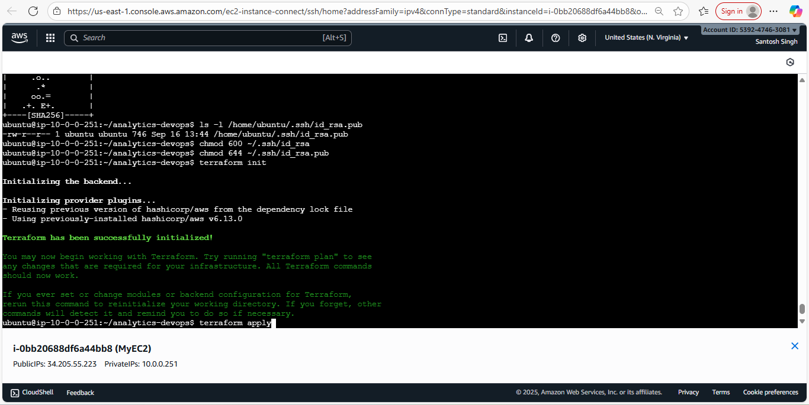
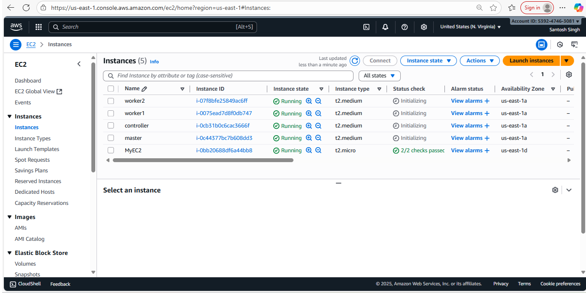
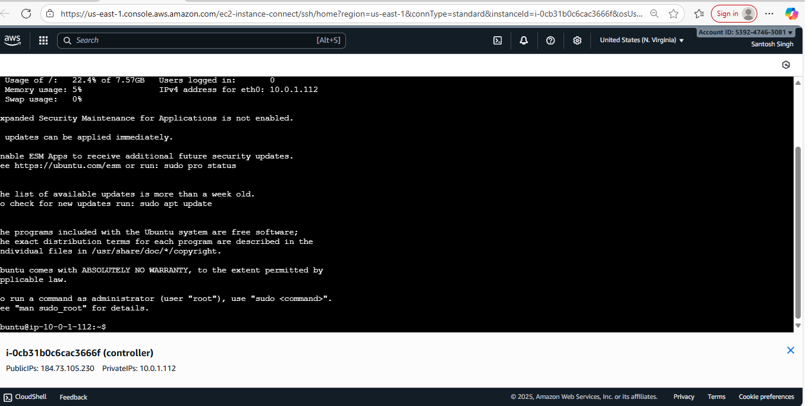
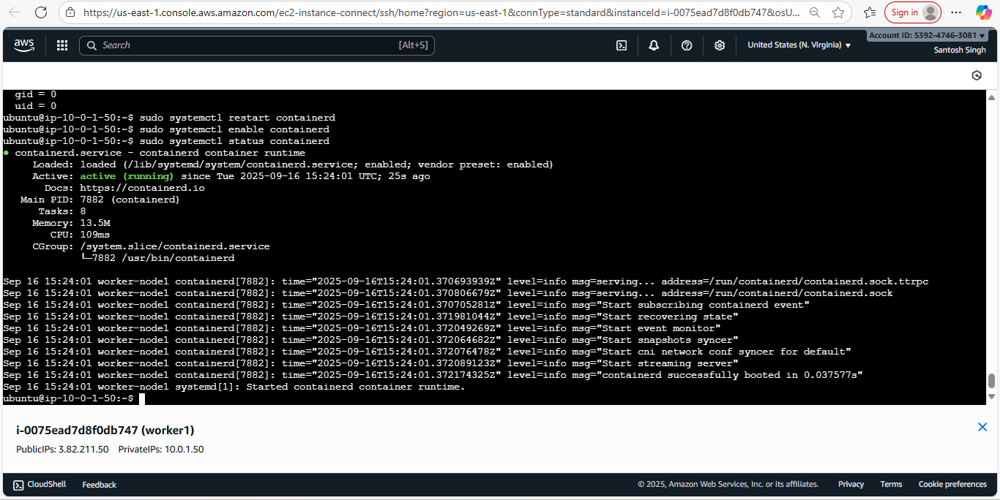
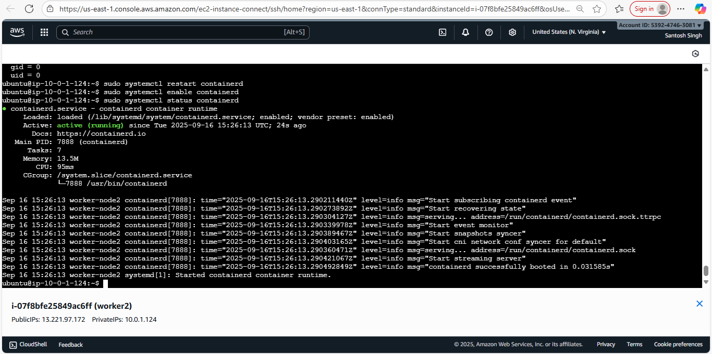
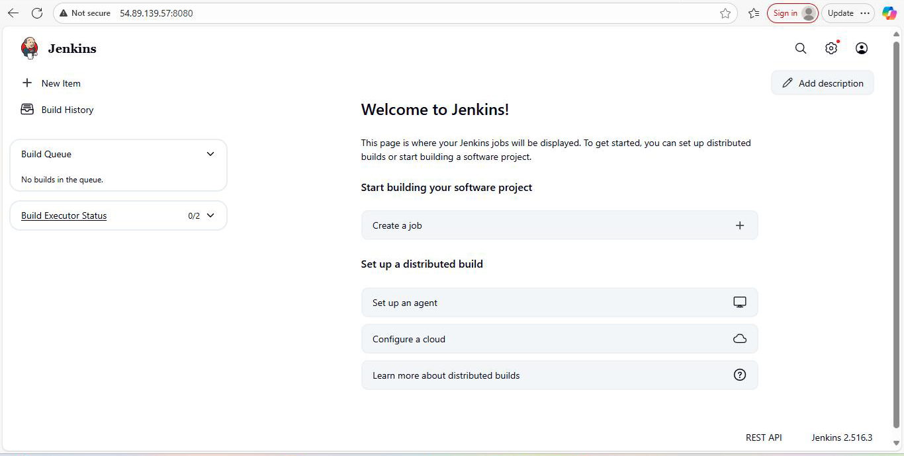
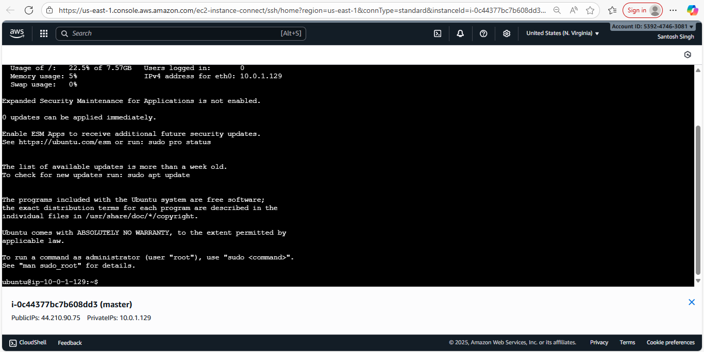
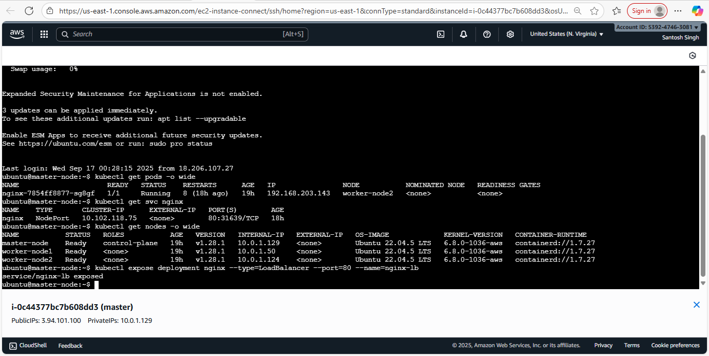
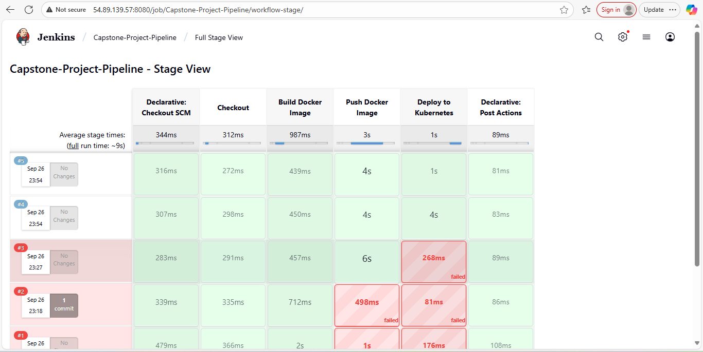
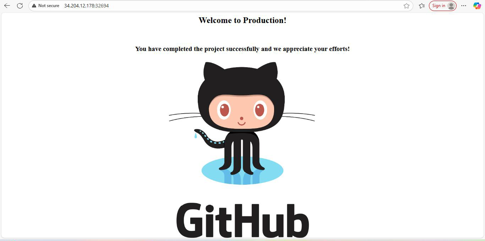

# 🚀 AWS DevOps CI/CD Pipeline on AWS


---

# 📌 Project Overview

This project demonstrates a complete DevOps lifecycle implementation on AWS.

The goal was to automate:

- Infrastructure Provisioning
- Configuration Management
- Containerization
- Continuous Integration
- Continuous Deployment
- Kubernetes Orchestration

using Terraform, Ansible, Docker, Jenkins, and Kubernetes.

## 🎯 Project Objectives

- Provision AWS infrastructure using Terraform
- Configure servers using Ansible
- Containerize application using Docker
- Automate CI/CD using Jenkins
- Deploy workloads on Kubernetes
- Validate deployment using automated pipelines
- Demonstrate end-to-end DevOps lifecycle
  
---

# 🏗 Architecture

```text
Developer
    │
    ▼
 GitHub Repository
    │
    ▼
 Jenkins Pipeline
    │
    ▼
 Docker Build
    │
    ▼
 Docker Hub
    │
    ▼
 Kubernetes Cluster
    │
    ▼
 Application Deployment
```

---

# ☁ AWS Infrastructure

Terraform provisions:

- VPC
- Public Subnet
- Internet Gateway
- Route Tables
- Security Groups
- Controller Node
- Kubernetes Master Node
- Kubernetes Worker Node 1
- Kubernetes Worker Node 2

---

# 🔧 Technologies Used

| Category | Technology |
|-----------|------------|
| Cloud | AWS |
| IaC | Terraform |
| Configuration Management | Ansible |
| Containerization | Docker |
| CI/CD | Jenkins |
| Orchestration | Kubernetes |
| Version Control | Git & GitHub |
| Registry | Docker Hub |

---

# 📂 Repository Structure

```text
aws-devops-cicd-kubernetes-project
│
├── terraform/
├── ansible/
├── docker/
├── kubernetes/
├── jenkins/
├── architecture/
├── screenshots/
└── README.md
```

---

# 🚀 Terraform

Provisioned AWS infrastructure using Terraform.

Resources created:

- VPC
- Subnet
- Internet Gateway
- Route Tables
- Security Groups
- EC2 Instances

Commands:

```bash
terraform init
terraform plan
terraform apply
```

---

# ⚙ Ansible

Automated server configuration.

Installed:

- Jenkins
- Java
- Docker
- Kubernetes Components

Command:

```bash
ansible-playbook -i inventory.ini setup.yml
```

---

# 🐳 Docker

Created custom Nginx image.

```dockerfile
FROM nginx:stable-alpine

RUN rm -rf /usr/share/nginx/html/*

COPY . /usr/share/nginx/html

EXPOSE 80
```

---

# ☸ Kubernetes

Deployment Features:

- Namespace Isolation
- 2 Replicas
- Rolling Updates
- NodePort Service

NodePort:

```text
30008
```

Commands:

```bash
kubectl apply -f namespace.yaml
kubectl apply -f deployment.yaml
kubectl apply -f service.yaml
```

---

# 🔄 Jenkins CI/CD Pipeline

Pipeline Stages:

1. Checkout Source Code
2. Build Docker Image
3. Push Docker Image
4. Deploy to Kubernetes
5. Validate Deployment

Release Schedule:

- Production deployment on 25th of every month

---

# 📊 CI/CD Workflow

```text
Developer Commit
        │
        ▼
      GitHub
        │
        ▼
      Jenkins
        │
        ▼
 Docker Image Build
        │
        ▼
     Docker Hub
        │
        ▼
 Kubernetes Cluster
        │
        ▼
   Application Live
```

---

# 📸 Project Screenshots


## 1. Terraform Infrastructure Provisioning

Terraform was used to provision AWS infrastructure including VPC, Subnets, Security Groups, Route Tables, and EC2 Instances.



Terraform initialization completed successfully and AWS provider plugins were downloaded and configured.

---

## 2. AWS EC2 Infrastructure

The following EC2 instances were provisioned automatically using Terraform:

- Controller Node
- Jenkins Server
- Kubernetes Master Node
- Kubernetes Worker Node 1
- Kubernetes Worker Node 2



---

## 3. Controller Node Configuration

The controller node was used to manage Terraform, Ansible, and deployment operations.



---

## 4. Worker Node 1 Configuration

Container runtime and Kubernetes worker components were configured successfully.



---

## 5. Worker Node 2 Configuration

Second Kubernetes worker node configured for workload distribution and high availability.



---

## 6. Jenkins Setup

Jenkins was installed and configured to automate the CI/CD pipeline.



Features implemented:

- Source Code Checkout
- Docker Image Build
- Docker Image Push
- Kubernetes Deployment

---

## 7. Kubernetes Master Node

Kubernetes control plane was configured successfully.



The master node manages:

- Scheduling
- Cluster State
- API Server
- Workload Orchestration

---

## 8. Kubernetes Cluster Validation

Cluster validation showing:

- Master Node
- Worker Node 1
- Worker Node 2
- Running Pods
- Services



---

## 9. Jenkins Pipeline Execution

Complete CI/CD pipeline execution.

Pipeline stages:

1. Checkout SCM
2. Checkout
3. Build Docker Image
4. Push Docker Image
5. Deploy to Kubernetes
6. Post Actions



---

## 10. Application Deployment Success

Final application successfully deployed and accessible through Kubernetes NodePort Service.



The application was deployed through the complete automated pipeline:

GitHub → Jenkins → Docker → Docker Hub → Kubernetes → Production

---

# ✅ Project Outcome

Successfully implemented an end-to-end DevOps pipeline on AWS that:

- Provisioned infrastructure using Terraform
- Configured servers using Ansible
- Containerized the application using Docker
- Automated CI/CD using Jenkins
- Deployed workloads on Kubernetes
- Validated deployment through automated pipeline execution

The application was successfully exposed through Kubernetes NodePort and verified through browser access.

---

# 🎯 Skills Demonstrated

- AWS Cloud
- Terraform
- Ansible
- Docker
- Jenkins
- Kubernetes
- GitHub
- CI/CD
- Infrastructure as Code
- Configuration Management
- Container Orchestration

---

# 🔮 Future Enhancements

- EKS Deployment
- GitHub Actions Integration
- Monitoring with Prometheus
- Grafana Dashboards
- ArgoCD GitOps

---

# 👨‍💻 Author

Santosh Singh

Solutions Architect | Cloud & DevOps Engineer

AWS | Azure | GCP | Terraform | Docker | Kubernetes | Jenkins
